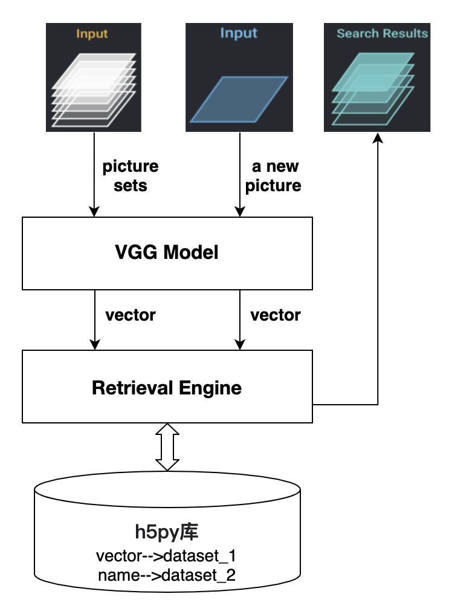

## 图片向量检索服务构建
该系统使用VGG（图像特征提取模型）和Numpy、Faiss、ES、Milvus构建了图像搜索流程。 系统架构如下：


### 基础环境安装
Python版本：3.6.10
```
pip install -r requirements.txt
```

### ES服务端安装
```
docker run -it -d -p 9200:9200 -p 9300:9300 -e "discovery.type=single-node" docker.elastic.co/elasticsearch/elasticsearch:7.5.0
```

### Milvus服务端安装
安装指南：https://milvus.io/cn/docs/milvus_docker-cpu.md <br>
下载配置
```
mkdir -p milvus/conf && cd milvus/conf
wget https://raw.githubusercontent.com/milvus-io/milvus/0.10.6/core/conf/demo/server_config.yaml
```
服务启动
```
docker run -d --name milvus_cpu_0.11.0 \
-p 19530:19530 \
-p 19121:19121 \
-v <ROOT_DIR>/milvus/db:/var/lib/milvus/db \
-v <ROOT_DIR>/milvus/conf:/var/lib/milvus/conf \
-v <ROOT_DIR>/milvus/logs:/var/lib/milvus/logs \
-v <ROOT_DIR>/milvus/wal:/var/lib/milvus/wal \
milvusdb/milvus:0.10.6-cpu-d022221-64ddc2
```

### 操作简介
操作一：构建基础索引
```
python index.py
--train_data：自定义训练图片文件夹路径，默认为`<ROOT_DIR>/data/train`
--index_file：自定义索引文件存储路径，默认为`<ROOT_DIR>/index/train.h5`
```
操作二：使用相似检索
```
python retrieval.py --engine=numpy
--test_data：自定义测试图片详细地址，默认为`<ROOT_DIR>/data/test/001_accordion_image_0001.jpg`
--index_file：自定义索引文件存储路径，默认为`<ROOT_DIR>/index/train.h5`
--db_name：自定义ES或者Milvus索引库名，默认为`image_retrieval`
--engine：自定义检索引擎类型，默认为`numpy`，可选包括：numpy、faiss、es、milvus
```

### 附录
参考1：https://github.com/willard-yuan/flask-keras-cnn-image-retrieval <br>
参考2：https://github.com/zilliz-bootcamp/image_search
